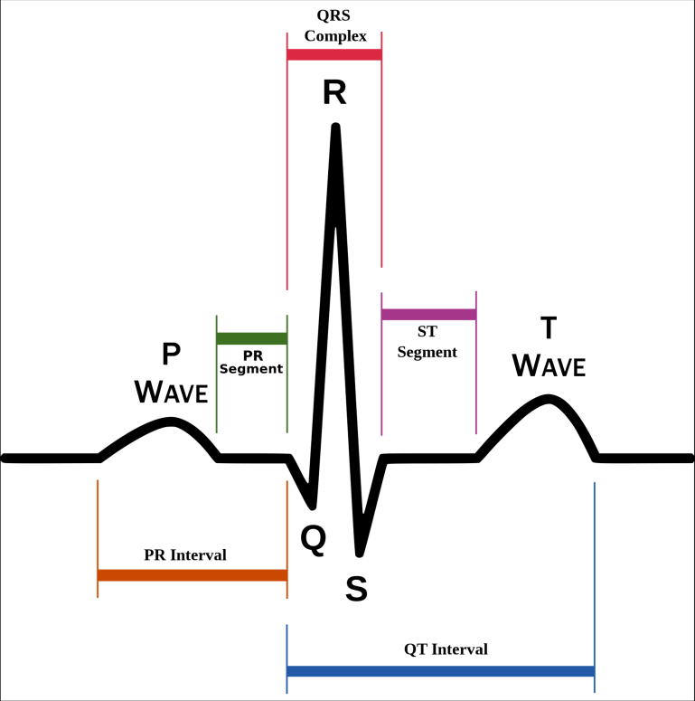

# Heart Disease Detection

# Dataset Features for Heart Disease Detection

## Demographic Information

- **Age:** Patient's age in years - a crucial factor as heart disease risk typically increases with age
- **Sex:** Patient's gender (1 for male, 0 for female) - important as heart disease patterns can vary between genders

## Clinical Symptoms

**Chest Pain Type (cp):** Categorized into four types:

- Typical angina: Classical heart-related chest pain
    
    Classic heart-related chest pain, usually triggered by physical activity or stress.
    
    **Symptoms:**
    
    Tightness, pressure, or squeezing feeling in the chest that may spread to the arms, neck, jaw, or back.
    
- Atypical angina: Less typical heart-related chest pain
    
    Chest pain that doesn’t feel like typical heart pain, but could still be related to heart problems.
    
    **Symptoms**: 
    
    Pain might be sharp, occur at rest, or feel like indigestion or shortness of breath.
    
- Non-anginal pain: Chest pain not related to heart
- Asymptomatic: No chest pain

## Vital Measurements

- **Resting Blood Pressure (`trestbps`)**
    
    The patient’s blood pressure in millimeters of mercury (mm Hg) when at rest. High values can indicate hypertension and potential risk for heart disease.
    
- **Serum Cholesterol (`chol`)**
    
    The total cholesterol level in the blood, measured in milligrams per deciliter (mg/dl). Elevated levels can increase the risk of cardiovascular disease.
    
- **Fasting Blood Sugar (`fbs`)**:
    
    Indicates whether the fasting (before eating) blood sugar level is greater than 120 mg/dl.
    
    - `1 = true` (high blood sugar — possible diabetes)
    - `0 = false` (normal)
- **Maximum Heart Rate Achieved (`thalach`)**:
    
    The highest heart rate reached during physical exertion or stress testing. Lower values may indicate poor heart function.
    

## Test Results (ECG)



- **Resting ECG (restecg):** Three categories of electrocardiogram results:
    - Normal
    - ST-T wave abnormality (indicates irregular heart patterns)
    - Left ventricular hypertrophy (indicates enlarged heart muscle)


- **Exercise-Induced Angina (exang):** Whether exercise causes chest pain (1 = yes, 0 = no)
- **ST Depression (`oldpeak`)**:
    
    The difference in ST segment levels between rest and peak exercise. A higher value may indicate reduced blood flow to the heart (ischemia).
    

- **ST Slope (slope):** Characterizes the ST segment slope during peak exercise:
    - Upsloping
    - Flat
    - Downsloping


## Advanced Diagnostics

- **Number of Colored Vessels (`ca`)**:
    
    Represents how many major blood vessels (0–3) show up in a fluoroscopy test.
    
    A higher number can suggest better blood flow.
    
- **Thallium Stress Test Result (`thal`)**:
    
    A nuclear imaging test assessing blood flow in the heart:
    
    “ **a procedure used to assess blood flow to the heart muscle during exercise or stress”**
    
    - **Normal** – healthy blood flow
    - **Fixed defect** – scarred heart tissue, possibly from a past heart attack
    - **Reversible defect** – temporarily reduced blood flow that can improve with treatment

These features together provide a comprehensive view of a patient's heart health status and are used in machine learning models to predict the likelihood of heart disease.

| **Feature** | **Min Value** | **Max Value** | **Notes** |
| --- | --- | --- | --- |
| **Resting Blood Pressure (trestbps)** | 80 mm Hg | 200 mm Hg | Values below 80 or above 200 are likely outliers or incorrect |
| **Serum Cholesterol (chol)** | 100 mg/dl | 600 mg/dl | Below 100 or above 600 should be flagged or checked |
| **Fasting Blood Sugar (fbs)** | 0 | 1 | Binary: 1 = True (sugar > 120), 0 = False |
| **Maximum Heart Rate (thalach)** | 60 bpm | 220 bpm | Usually depends on age; >220 is highly unlikely |
| **Colored Vessels (ca)** | 0 | 3 | Should only be 0, 1, 2, or 3 — anything else is invalid |

# Correlation heat map of the features


**CP**: Chest pain type

- Value 0: Typical angina

- Value 1: Atypical angina

- Value 2: Non-anginal pain

- Value 3: Asymptomatic

**restecg**: Resting electrocardiographic results

- Value 0: Normal

- Value 1: Having ST-T wave abnormality (T wave inversions and/or ST elevation or depression of > 0.05 mV)

- Value 2: Showing probable or definite left ventricular hypertrophy by Estes' criteria

**slope**: The slope of the peak exercise ST segment  
    - Value 0: Upsloping  
    - Value 1: Flat  
    - Value 2: Downsloping  

 **thal**:  
    - 0 = Error (in the original dataset, 0 maps to NaN's)  -this was removed when training-
    - 1 = Fixed defect  
    - 2 = Normal  
    - 3 = Reversible defect  

## Visualizations on data


People who are 55-65 aged, are having a higher probability of being diseased 


people with low heart function shows more disease conditions


How cholesterol affects the Heart

# Data pre-processing pipeline

```python
# catogrical columns -> cp , restecg, thal, slop
class CustomCategoricalEncoder(BaseEstimator, TransformerMixin):
    def __init__(self):
        self.encoders = {}
        self.cat_features = ['cp', 'restecg', 'thal', 'slope']

    def fit(self, X, y=None):
        for feature in self.cat_features:
            encoder = OneHotEncoder(sparse_output=False, handle_unknown='ignore')
            encoder.fit(X[[feature]])
            self.encoders[feature] = encoder
        return self

    def transform(self, X):
        X = X.copy()
        for feature in self.cat_features:
            encoder = self.encoders[feature]
            encoded = encoder.transform(X[[feature]])
            feature_names = encoder.get_feature_names_out([feature])
            for i, name in enumerate(feature_names):
                X[name] = encoded[:, i]
            X.drop(feature, axis=1, inplace=True)
        return X

    
class CustomStandardScaler(BaseEstimator, TransformerMixin):
    def __init__(self):
        self.scaler = StandardScaler()
        self.num_features = ['age', 'trestbps', 'chol', 'thalach', 'oldpeak']

    def fit(self, X, y=None):
        self.scaler.fit(X[self.num_features])
        return self

    def transform(self, X):
        X = X.copy()
        X[self.num_features] = self.scaler.transform(X[self.num_features])
        return X

    

data_processing_pipeline = Pipeline(steps=[
    ('custom_categorical_encoder', CustomCategoricalEncoder()),
    ('custom_standard_scaler', CustomStandardScaler())
])

```

# Model performance

### 1. logistic regression


 cross_val_score: 0.8343502824858756

### 2. DecisionTreeClassifier


cross_val_score: 0.7907909604519774

### 3. RandomForestClassifier


cross_val_score: 0.8142372881355933

### 4. SVC


cross_val_score: 0.8310169491525423

### 5. KNeighborsClassifier


cross_val_score: 0.8108474576271186

### 6. GaussianNB


cross_val_score: 0.817683615819209

# Model Performance Comparison


# Model selection

Selected Model - Logistic Regression 

```python
model = LogisticRegression(C=1, solver='lbfgs')
model.fit(X_train, y_train)
y_pred = model.predict(X_test)
accuracy = cross_val_score(model, X, y, cv=5).mean()
print(f"Accuracy of Logistic Regression: {accuracy:.2f}")
```

Accuracy of Logistic Regression: 0.83

# Model Export and Pre-processor export

```python
import pickle

# After fitting
data_processing_pipeline.fit(X)
X = data_processing_pipeline.transform(X)
final_model = LogisticRegression(C=1, solver='lbfgs')
final_model.fit(X, y)

# Save pipeline and model using pickle
with open('../models/heart-pred/preprocessor.pkl', 'wb') as f:
    pickle.dump(data_processing_pipeline, f)

with open('../models/heart-pred/model.pkl', 'wb') as f:
    pickle.dump(final_model, f)

y_pred_all = final_model.predict(X)
accuracy_all = accuracy_score(y, y_pred_all)
classification_report_all = classification_report(y, y_pred_all)
confusion_mat_all = confusion_matrix(y, y_pred_all)

print(f"Accuracy on all data: {accuracy_all:.2f}")
print("Classification Report:\n", classification_report_all)
```

```python
Classification Report:
               precision    recall  f1-score   support

           0       0.91      0.82      0.86       136
           1       0.86      0.93      0.89       160

    accuracy                           0.88       296
   macro avg       0.89      0.88      0.88       296
weighted avg       0.88      0.88      0.88       296
```

# Making Predictions on APP

```python
with open('models/heart-pred/preprocessor.pkl', 'rb') as preprocessor_file:
    preprocessor = pickle.load(preprocessor_file)

with open('models/heart-pred/model.pkl', 'rb') as model_file:
    model = pickle.load(model_file)
    
pred_df = pd.DataFrame({
                'age': age,
                'sex': sex,
                'cp': cp,
                'trestbps': trestbps,
                'chol': chol,
                'fbs': fbs,
                'restecg': restecg,
                'thalach': thalach,
                'exang': exang,
                'oldpeak': oldpeak,
                'slope': slope,
                'ca': ca,
                'thal': thal
            }, index=[0])

# Preprocess the input data
X_new = preprocessor.transform(pred_df)

# Make predictions
y_pred_new = model.predict(X_new)
y_pred_new_proba = model.predict_proba(X_new)
    
```

# Conclusion

Based on our analysis of the heart disease detection model, we achieved strong performance with the Logistic Regression classifier, obtaining an accuracy of 88% on the complete dataset. The model demonstrates balanced precision and recall scores for both classes, making it reliable for clinical decision support. Furthermore, the successful implementation of our data preprocessing pipeline and model deployment enables practical application through a user-friendly interface.